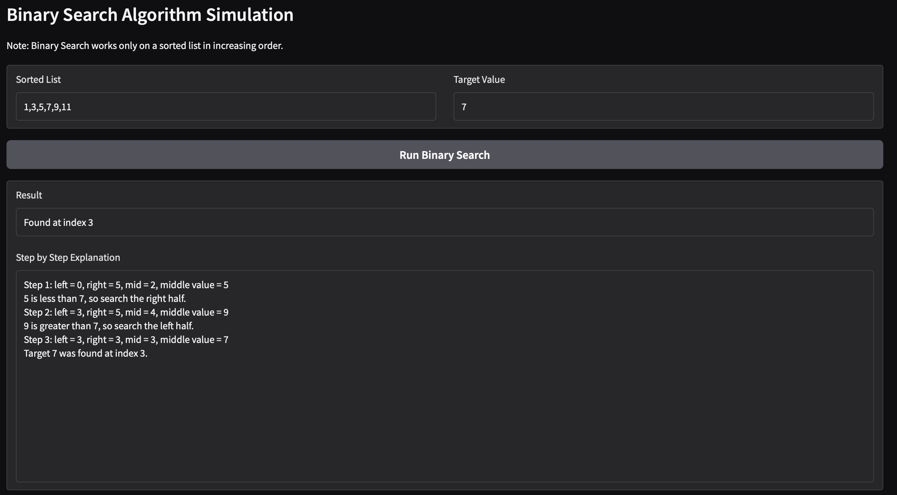
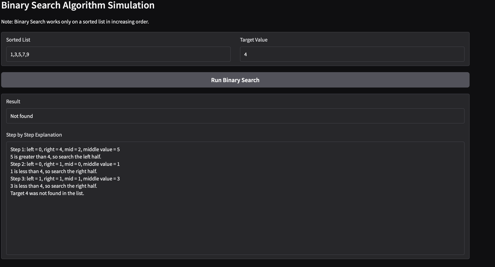
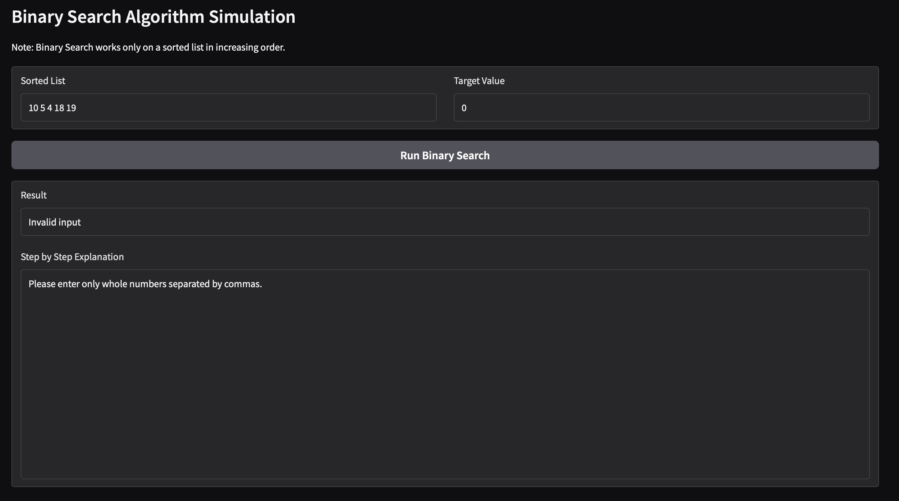

# Binary Search Test Simulation App

## Demo Screenshot / GIF / Video
Add screenshots or a short demo here showing your app working.

## Problem Breakdown & Computational Thinking

### Chosen Algorithm
I chose Binary Search because it is an efficient algorithm that quickly finds a value in a sorted list. It works by repeatedly dividing the search space in half.

### Decomposition
The problem is broken into steps:
1. Take a sorted list from the user
2. Take a target value
3. Find the middle element
4. Compare it to the target
5. Search left or right half
6. Repeat until found or not found

### Pattern Recognition
Binary Search follows a repeating pattern:
- compare middle value to target
- eliminate half of the list
- repeat

### Abstraction
The user only enters a list and a target. The program handles all comparisons and logic internally and displays only the important results.

### Algorithm Design
Input → Processing → Output

- Input: sorted list and target
- Processing: binary search reduces the search space each step
- Output: result (found or not) and step-by-step explanation

## Steps to Run
1. Install Python
2. Run: pip install -r requirements.txt
3. Run: python app.py
4. Open the Gradio link

## Testing & Verification

Test 1:
Input: 1, 3, 5, 7, 9  
Target: 7  
Expected: Found at index 3  
Actual: Found at index 3  

Test 2:
Input: 1, 3, 5, 7, 9  
Target: 4  
Expected: Not found  
Actual: Not found  

Test 3:
Input: 9, 3, 1, 7  
Target: 3  
Expected: Error  
Actual: Error shown  

Test 4:
Input: 1, 3, x, 7  
Target: 7  
Expected: Invalid input  
Actual: Invalid input shown  

## Hugging Face Link
Paste your Hugging Face link here.

## Author & Acknowledgment
Eitan Barron  
CISC 121 Project  
Used Python and Gradio
